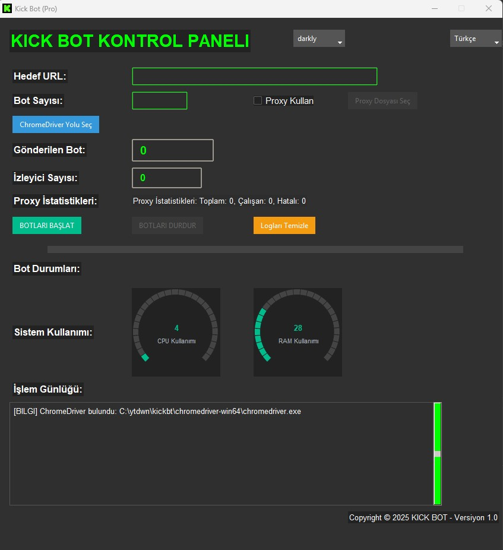

# KickBots

**Kick Bot Kontrol Paneli**  
Selenium tabanlı bir otomasyon aracı ile Kick platformundaki yayınlara izleyici botları gönderebilmenizi sağlar. Kullanıcı dostu arayüzü ile bot sayısı, yayın URL’si, proxy ve dil seçeneklerini kolayca yapılandırabilirsiniz.

 <!-- Ekran görüntüsü ekleyeceksen bu kısmı aktif et -->

---

## 🚀 Özellikler

- 🎯 **Otomatik Bot Yönetimi**: Yayın URL’sine istenilen sayıda bot gönderimi ve otomatik video oynatımı.
- 🌐 **Proxy Desteği**: HTTP ve SOCKS5 proxy kullanımı; dışarıdan dosya olarak yüklenebilir.
- 🌍 **Çoklu Dil Desteği**: Türkçe 🇹🇷 ve İngilizce 🇬🇧 arayüz.
- 🎨 **Tema Seçenekleri**: Darkly, Flatly, Litera, Superhero, Cyborg, Vapor temaları.
- 📊 **Sistem İzleme**: Gerçek zamanlı CPU ve RAM kullanımı izleme (Meter widget'ları).
- 📁 **Loglama**: Detaylı işlem günlüğü ve hata yakalama.
- 🛡️ **Gizlilik ve Güvenlik**: Headless tarayıcı, rastgele mouse hareketleri ile bot tespiti önleme.
- 🧩 **Kullanıcı Dostu Arayüz**: Sezgisel GUI ile kolay kullanım.

---

## ⚙️ Gereksinimler

- **Python**: 3.8 ve üzeri (3.12 önerilir)
- **Chrome Tarayıcı**: Güncel sürüm
- **ChromeDriver**: Tarayıcı sürümüne uygun versiyon
- **İşletim Sistemi**: Windows (Linux/macOS için ek yapılandırmalar gerekebilir)

---

## 🔧 Kurulum

## Gereksinimler
- **Python**: 3.8 veya üstü (3.12 önerilir)
- **Chrome Tarayıcı**: Güncel sürüm
- **ChromeDriver**: Chrome tarayıcı sürümüne uygun
- **İşletim Sistemi**: Windows (Linux veya macOS için ek yapılandırma gerekebilir)

##Önemli Notlar
- Sistem Yükü: CPU veya RAM kullanımı %99’u aşarsa, botlar otomatik olarak durdurulur.
- Proxy Doğrulama: Geçersiz proxy formatları loglanır ve kullanılmaz.
- API Kullanımı: İzleyici sayısı ve yayın durumu, harici bir API (Kendi apinizi kullanın) üzerinden alınır. Bu API’nin erişilebilir olduğundan emin olun.
- ChromeDriver Uyumluluğu: ChromeDriver sürümünün tarayıcınızla eşleşmesi gerekir, aksi takdirde hata alırsınız.
- Hata Ayıklama: Herhangi bir hata durumunda, log dosyalarını ve konsol çıktısını kontrol edin.

## Bağımlılıklar
Projenin çalışması için aşağıdaki Python kütüphaneleri gereklidir:
```bash
pip install ttkbootstrap selenium psutil requests
```

### 1. Depoyu Klonlayın
```bash
git clone https://github.com/TKNAjans/KickBots.git
```
```bash
cd kickbots
```
⚠️ Yasal Uyarı / Sorumluluk Reddi

Bu yazılım yalnızca eğitim, test ve araştırma amaçlı geliştirilmiştir. Amacı, otomasyon tekniklerinin öğrenilmesini sağlamak ve kişisel projelerde kullanılabilecek örnek bir otomasyon altyapısı sunmaktır.

Kick platformu gibi canlı yayın servislerinin kullanım koşulları, bot kullanımını açıkça yasaklamış olabilir. Bu yazılımı üçüncü taraf platformlarda kullanmak, ilgili platformun hizmet şartlarını ihlal edebilir ve kullanıcı hesabınızın kalıcı olarak yasaklanmasına yol açabilir.

Bu yazılımın kötüye kullanımından doğacak her türlü sonuçtan yalnızca kullanıcı sorumludur. Yazılım geliştiricisi, bu yazılımın doğrudan veya dolaylı kullanımından kaynaklı oluşabilecek hiçbir yasal, teknik veya etik sorumluluğu kabul etmez.

Yazılımı indirerek veya kullanarak, bu koşulları okuduğunuzu, anladığınızı ve kabul ettiğinizi beyan etmiş olursunuz.
